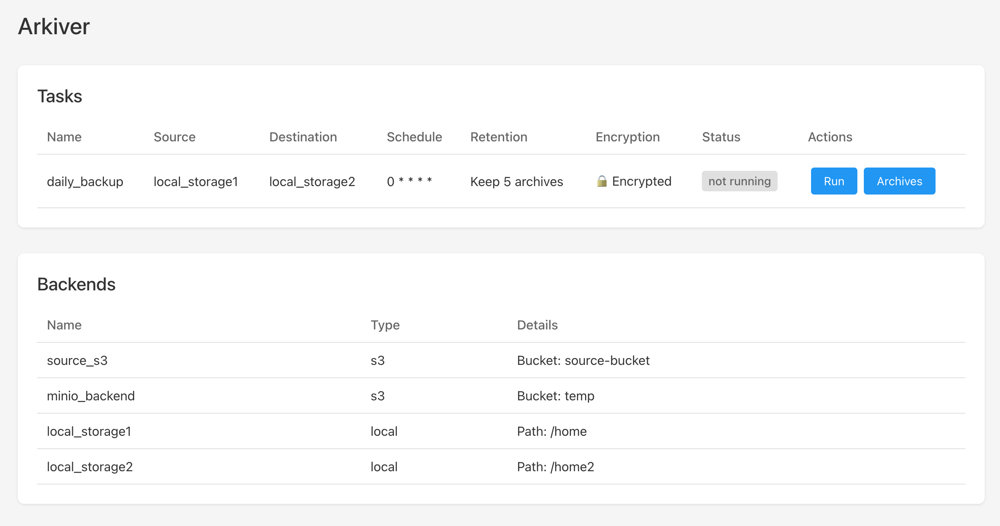

# Arkiver

## What is Arkiver ?

Arkiver is a self-hosted file archiving solution I created to fill a specific need: creating simple, encrypted archives of files without the complexity of deduplication or incremental backups. While many backup solutions exist, most focus on efficient storage with features like deduplication and incremental backups. However, I wanted something simpler:

- Create straightforward ZIP archives
- Encrypt them securely
- Store them wherever I want (local or S3)
- Monitor and trigger tasks through a simple web interface

So I built Arkiver to do exactly that - create archives in a simple, secure, and reliable way. No deduplication, no incremental backups, just straightforward file archiving with encryption and flexible storage options.

## Screenshots



## Features

- **Multiple Storage Options**:
  - Local file system for simple backups
  - AWS S3 and S3-compatible services (MinIO, etc.)

- **Security**:
  - AES-256-CBC encryption
  - Per-task encryption keys
  - Secure key management

- **Task Management**:
  - Cron-based scheduling
  - Manual task execution
  - Real-time status monitoring
  - Queue-based execution
  - Configurable retention policies

- **Simple Web Interface**:
  - Clear task status indicators
  - Easy manual task execution

## Setup

### Local Setup

1. Install dependencies:
```bash
npm install
cd client && npm install --legacy-peer-deps && cd ..
```

2. Build:
```bash
npm run build
cd client && npm run build && cd ..
```

3. Run the application:

```bash
npm start
```

The application will be accessible at:

- Production mode: http://localhost:3001

### Docker Setup

1. Build the Docker image:
```bash
docker build -t arkiver .
```

2. Run the container:
```bash
# Create a directory for your config
mkdir -p ./config

# Copy your config.yaml to the config directory
cp config.yaml ./config/

# Run the container
docker run -d \
  -p 3001:3001 \
  -v $(pwd)/config.yaml:/app/config/config.yaml \
  --name arkiver \
  arkiver
```

## Configuration file

Create a `config.yaml` file. By default, it should be in the root directory of the project, but you can specify a different path using the `CONFIG_PATH` environment variable:

Example configuration:

```yaml
backends:
  local_source:
    type: local
    path: /path/to/source

  s3_destination:
    type: s3
    bucket: my-backup-bucket
    region: us-west-2
    prefix: backups/

tasks:
  daily_backup:
    source: local_source
    destination: s3_destination
    prefix: daily-backup  # Custom prefix for archive filenames (e.g. daily-backup-2025-02-25.zip)
    retention: 7  # Keep last 7 backups
    schedule: "0 0 * * *"  # Run daily at midnight
    retention: 7  # Keep last 7 archives
```

## Encryption

### Configuration

To enable encryption for a task, add the encryption configuration in `config.yaml`:

```yaml
tasks:
  daily_backup:
    source: local_storage1
    destination: s3_destination
    schedule: "0 0 * * *"
    retention: 7
    encryption:
      enabled: true
      key: "your-secret-key"  # Replace with your secure key
```

### Encrypted Files

When encryption is enabled:
- Files are encrypted using AES-256-CBC before being archived
- Encrypted archives have a `.crypt` extension
- Files are processed in chunks to handle large files efficiently

### Decryption

Encrypted archives can be decrypted using OpenSSL:

```bash
# Decrypt a file (will prompt for the encryption key)
openssl enc -d -aes-256-cbc -md md5 -in archive.zip.crypt -out decrypted.zip
```

The decrypted ZIP file can then be extracted normally.

### Security Best Practices

- Store encryption keys securely
- Use strong, unique keys for each task
- The encryption key must be the same for decryption
- Backup your keys - lost keys mean lost data!

## Task Status States

Tasks can be in one of three states:
- **Running**: Task is currently executing
- **Waiting**: Task is queued behind another running task
- **Not Running**: Task is idle

## Notes

- Only one task can run at a time
- Tasks are queued in order of execution request
- Retention policies are enforced after successful transfers
- Real-time status updates in the web interface
- Encrypted files use AES-256-CBC encryption

## API Endpoints

- GET `/api/tasks` - List all configured tasks
- GET `/api/backends` - List all configured backends
- POST `/api/tasks/:taskName/execute` - Manually execute a task
- POST `/api/config/reload` - Reload configuration

## Development

- Run: `npm start`
- Build: `npm run build`
- Test: `npm test`

## License

Arkiver is licensed under the GNU General Public License v3.0 (GPLv3).

This means you are free to:
- Use the software for any purpose
- Change the software to suit your needs
- Share the software with others
- Share the changes you make

Under the following terms:
- You must disclose your source code when you share the software
- You must license your modifications under the GPLv3
- You must preserve the original copyright and license notices
- You provide a copy of the license and copyright notice with the software

For the full license text, see [GNU GPLv3](https://www.gnu.org/licenses/gpl-3.0.en.html).
